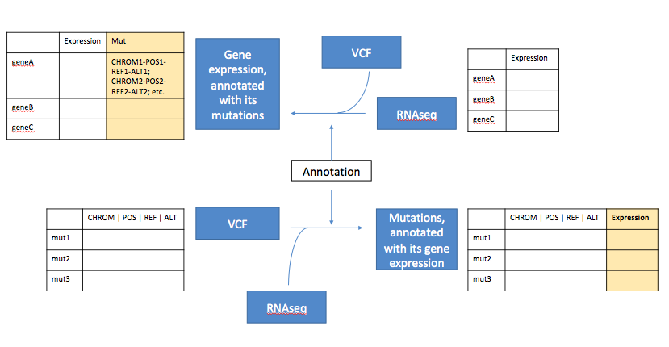

# ExpressiVar

[](https://travis-ci.org/NCBI-Hackathons/ExpressiVar)


<p align="center">
  
</p>


## Installation

```
git clone https://github.com/NCBI-Hackathons/ExpressiVar
cd ExpressiVar && pip install -e
```

## Motivation

This package contains helper functions to annotate structural variants (SVs) and single nucleotide variants (SNVs) from either a VCF-format or BEDPE-format file.


## Dependencies 

The package relies on 
* PyVCF (>= 0.6.7) https://github.com/jamescasbon/PyVCF


## Usage

### Inputs

### Outputs


### Contributors

* Evan Biederstedt 
* Kundai Andrew Midzi
* Tze Yin Lim
* Naina Thangaraj
* Kelly Terlizzi
* Peng Zhang

This project was initiated at an NCBI-style hackathon at the NYGC on August 2018.