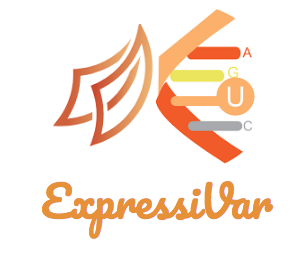
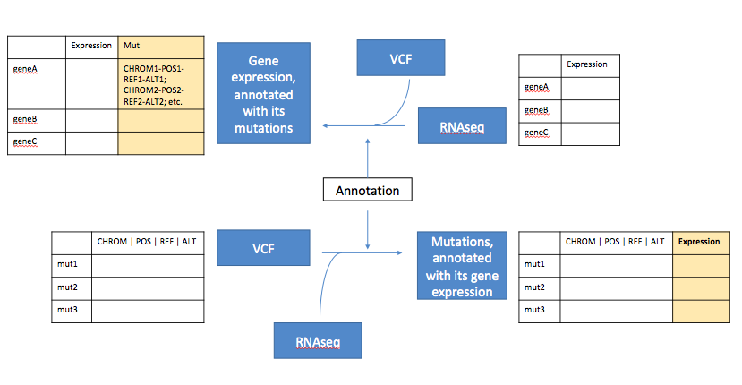

# ExpressiVar

[](https://travis-ci.org/NCBI-Hackathons/ExpressiVar.svg?branch=master)


<p align="center">
  
</p>


## Installation

```
git clone https://github.com/NCBI-Hackathons/ExpressiVar
cd ExpressiVar && pip install -e
```

## Motivation


<p align="center">
  
</p>


This package contains a python package that can be used in two modes. 

* Annotate a VCF with gene expression level data
* Include variant information in expression counts

## Dependencies 

The package relies on 
* PyVCF (>= 0.6.7) https://github.com/jamescasbon/PyVCF

## Usage

There are two modes in which you can call ExpressiVar --
```
python ExpressiVar_VCF_to_Expression.py <path-to-vcf-file> <path-to-counts-file>
```
This would take a VCF file and along with the counts expression data and annotate it with the gene expression level information. 
```
python ExpressiVar_Expression_to_VCF.py RNAseq2VCF <path-to-counts-file> <path-to-vcf-file>
```
This will be working with the counts expression data and annotate it with variance information from the VCF file. 

Additionally, we can also annotate promotor regions. 
```
python ExpressiVar_VCF_PromoterAnnotator.py <path-to-vcf-file>
```
### Assumptions

 The VCF file should be annotated using either SnPEff or VEP. 

### Inputs

This package reads in a RNAseq VCF file, along with count information. We have tested this with outputs from GATK RNAseq best practices pipeline, and RNAseq quantifications tools such as FeatureCounts from the subread package. 

### Outputs

This package can produce two outputs --

* A RNAseq VCF file containing expression level annotations.
* A counts file with variants information.

### Contributors

* Evan Biederstedt 
* Kundai Andrew Midzi
* Tze Yin Lim
* Naina Thangaraj
* Kelly Terlizzi
* Peng Zhang

This project was initiated at an NCBI-style hackathon at the NYGC on August 2018.
